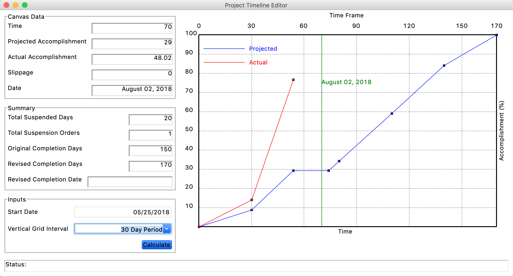
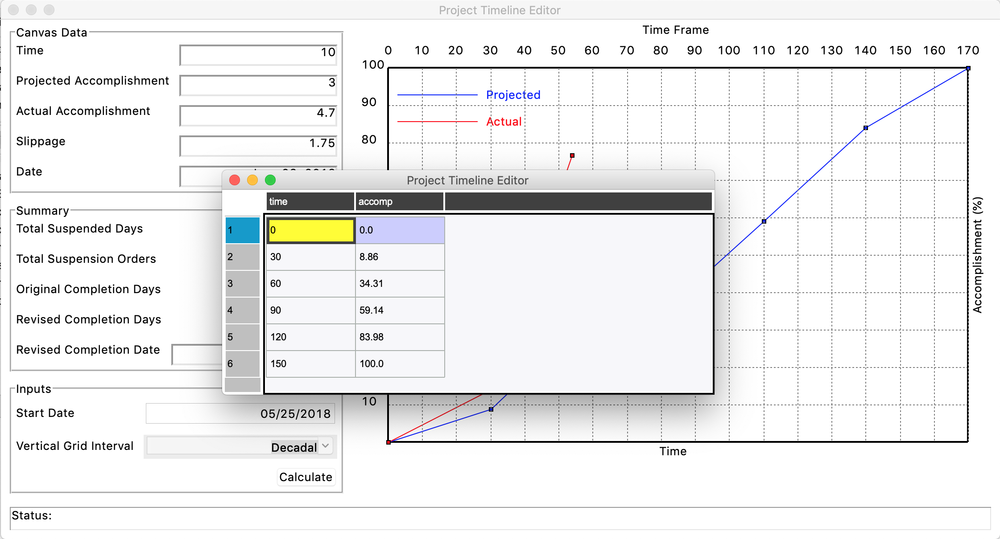

# Project Timeline Editor

**Project Timeline Editor** is a desktop application to view and edit project
or contract timeline in a graphical way to easily visualize the activities.

## Screenshots
### 1. Project opened

### 2. Projected accomplishment editor

**Download**
---
Here are the available releases.

- [Pre-release v0.1.0 (Windows)](https://github.com/alexiusacademia/project-timeline-editor/releases/download/v0.1.0/ProjectTimelineEditor.exe)
- [Pre-release v0.2.0 (Windows)](https://github.com/alexiusacademia/project-timeline-editor/releases/download/v0.2.0/ProjectTimelineEditor.exe)

Copyright 2019 Alexius Academia