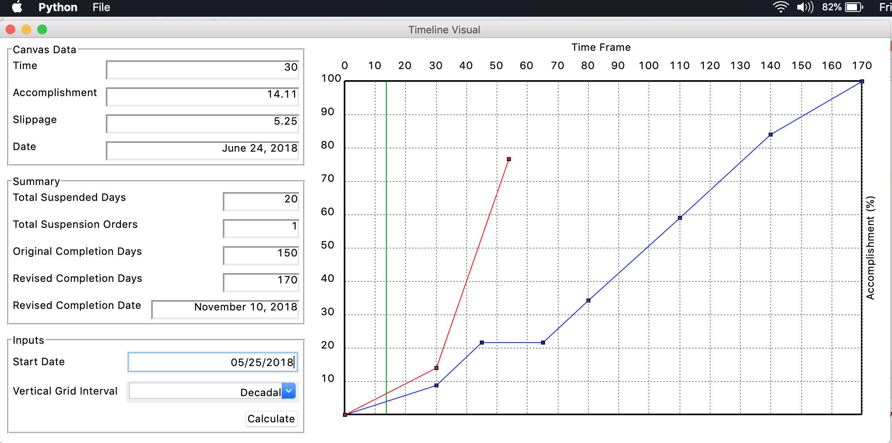

# Project Timeline Editor


**Project Timeline Editor** is a desktop application to view and edit project
or contract timeline in a graphical way to easily visualize the activities.


**Running**
---
The software has no package yet, but it can be run using the main.py script
with python installed on the system.
```commandline
python main.py
```

Copyright 2019 Alexius Academia